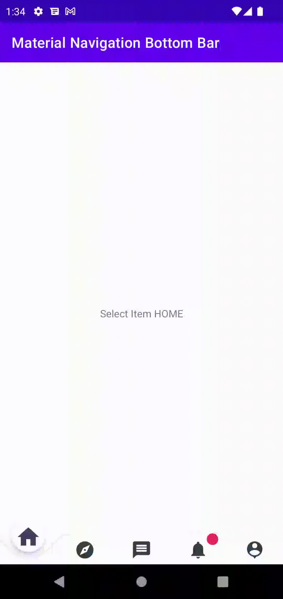

  

<h3 align="center">MaterialBottomNavigation</h3>

---

 A Material Navigation Bottom bar library.
      

## ⛏️ Built Using 

- [Android](https://android.com/) - java/kotlin/Android Framework

## ✍️ Authors 

- [@skbhati199](https://github.com/skbhati199) - Idea & Initial work

See also the list of [contributors](https://github.com/skbhati199/The-Documentation-Compendium/contributors) who participated in this project.

## 🎉 Acknowledgements 

- Hat tip to anyone whose code was used
- Inspiration
- References
